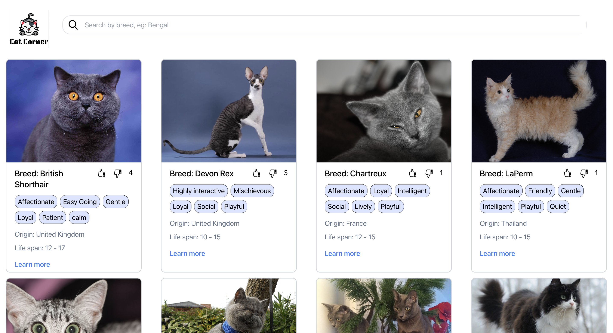

# WARACLE

Screenshot of the app:


## Cat App
* The app is built using React, Redux and TypeScript
* For styling, TailwindCSS is used
* API source: https://api.thecatapi.com/v1/images/
* Features: 
  * User can "like" or "unlike" the cat image and the score will update accordingly
  * Cat images are sorted based on score in descending order
  * User can search for cats by breed name using the search bar

## How to start the app
1. Clone the repo locally
```
git clone https://github.com/francisldn/Waracle.git
```
2. Install dependencies from the root directory
```
npm install
```
3. Create ``.env`` file and fill in the API details, following the example in ``.env.example``
4. Start the app using the command below
```
npm run start
```
5. Build the app
```
npm run build
```
